# aw09-final

Please develop a **fully functional** online purchase order system.

- It should have a superb collection of goods merchandises
- Customer can browse/search for merchandises, add selected one into his shopping cart and checkout to complete a transaction.
- User can get delivery status updates continuously.

The system should be of a **reactive architecture** based on Spring Webflux. And the system should be 

-  Responsive: it should response to the user request timely.
-  Resilient: it should not be easily broken down.
-  Elastic: it should be flexible to scale out.
-  Message Driven: it should has loosely coupled components that communicates with each other asynchronously.

Please design tests/experiements to demostrate that your system fulfills such requirements as stated in [The Reactive Manifesto](https://www.reactivemanifesto.org)

**Submit your codes/documentation/tests/experiements of your system**

**Please write an article titled "My Perspective on Software Architecture" (the length and quality of the article will determine your score).**

---

>   -   It should have a superb collection of goods merchandises

本次作业的数据集沿用了 aw07 中批处理的 Amazon 数据集，商品数量在 $10^5$ 级别。因此在 `getProducts()` 方法中，不能直接返回所有商品，处理方法是在这个方法的路径中加入 `page` 参数，结合 mysql 中 `offset` 操作来将商品分页，每次返回一页商品的内容

>   -   Customer can browse/search for merchandises, add selected one into his shopping cart and checkout to complete a transaction.

使用了之前作业中的微服务架构，将项目分成若干模块

-   `api` 模块，维护每个模块都用到的 common 类，例如网络传输中使用的 Dto 层对象，还有一些工具类等
-   `delivery` 模块，负责维护和更新用户的快递信息
-   `discovery` 模块，使用 eureka 管理多个微服务，服务之间通过注册在 eureka 的服务名进行访问，由 eureka 来做负载均衡
-   `flux-order` 模块，负责订单信息的管理和更新，用户提交订单之后，此模块会向 `flux-product` 模块发起请求，更新数据库的内容
-   `flux-product` 模块，负责管理商品信息，提供浏览和搜索接口，只需要在 url 中访问对应的接口即可
-   `gateway` 模块，作为网关层，提供唯一的对外接口，使用 jwt 做鉴权，过滤非法的用户请求，配合 eureka 做负载均衡
-   `user` 模块，管理用户信息，用户登录时生成 jwt token

>   -   User can get delivery status updates continuously.

在 `flux-order` 模块中，当用户完成下单，此模块会通过消息队列向 `delivery` 模块发送信息，后者收到信息之后会在快递表中生成对应的表项，用户可以根据 id 查询自己的快递信息

>   -   Responsive: it should response to the user request timely.

体现在 `flux-order` 和 `flux-product` 模块中，相较于之前的作业，此次作业将这两个模块从 SpringMVC 架构改为 Webflux 架构，使用响应式的 r2dbc 来访问和操作数据库

>   -   Resilient: it should not be easily broken down.

保留了此前作业中使用过的 `circuitbreaker-reactor-resilience4j` 断路器，同时也在流式编程中借助响应式编程中的 `onError()` 方法做了错误处理

>   -   Elastic: it should be flexible to scale out.

由于是使用微服务架构，系统的可扩展性得以保证，通过同一模块部署多个实例的方式，可以轻松实现规模的扩展。将数据库、rabbitMq、redis 等服务配置在云服务器上，实现了分布式部署

>   -   Message Driven: it should has loosely coupled components that communicates with each other asynchronously.

模块之间通过 WebClient 来发起访问，替代了之前的 RestTemplate，同样起到了降低模块间耦合度的作用；使用 rabbitMq 作为消息队列，实现消息驱动机制

---

[详细的实验记录](https://pxe09in4bw.feishu.cn/docx/WzcWdmW37oLl2SxQPWpcuxhsnfg#CdzndeWI6oao1bxZyJhcgqQCnId)

**一些可以讨论的点**

-   在 aw07 建立数据集的时候，为了配合 url 检测，我把 url 单独分出一个表，因此在 `product` 模块中查询出商品之后，还需要做一个 join 的操作，此时就要再查另一个表，才能得到完整的商品信息
-   为了加速商品访问的速度，我沿用了此前作业用过的 redis 作为商品的缓存，但是在响应式框架中要使用 `ReactiveRedisTemplate` 来访问 redis，同时要实现相关的配置类
-   用户下单的时候，会传来一个列表，需要对列表的每一项都执行更新数据库的操作，但是可能存在某个商品库存不足的情况，同时也要考虑并发修改的情况。我的实现是对于 `order` 接收到的列表的每一项，都传递到 `product` 模块处理，先开启一个事务，然后通过一个 `select for update` 锁住这一行，然后判断库存是否满足，满足的话就更新数据，并返回成功/失败。`order` 判断每个请求的返回值，将请求失败的项通过错误信息的方式传递到前端，告知用户哪些商品没有成功下单

**功能测试环节**

首先开启所有服务

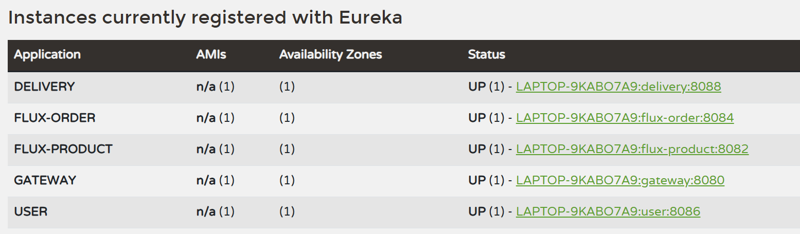

测试一下用户登录，得到了一个用户的 token

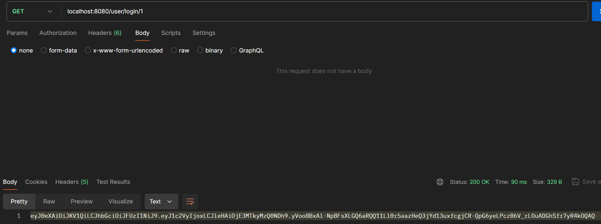

然后测试商品获取

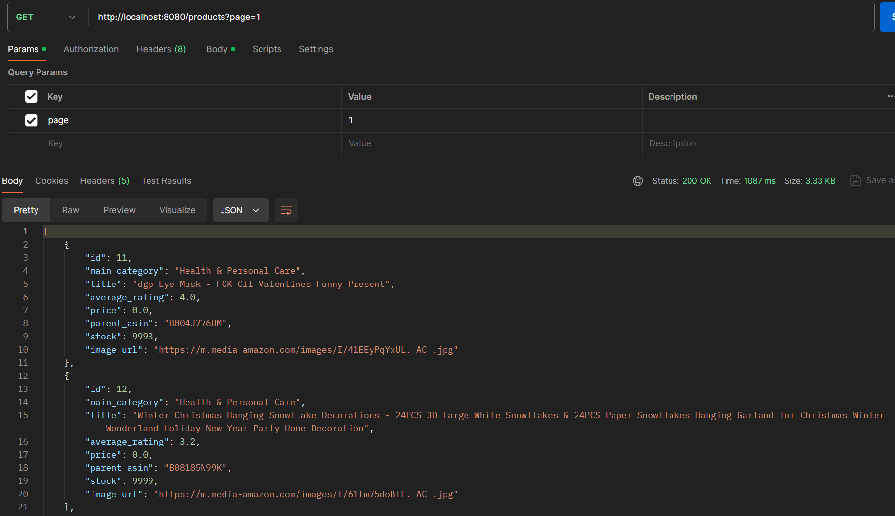

查询特定商品

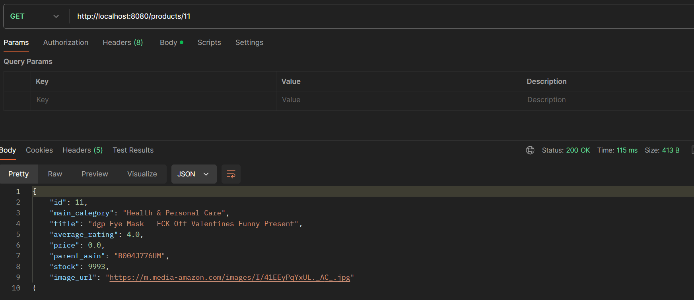

如果要下单，当某个商品库存超出限制，会得到失败的下标

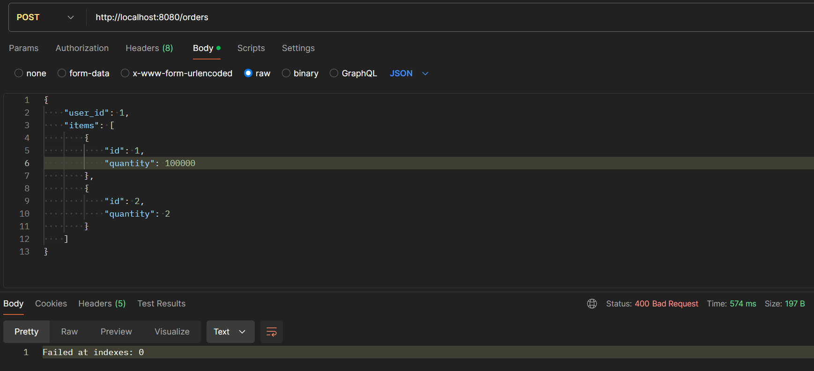

正常下单后，可以在 delivery 表中生成表项

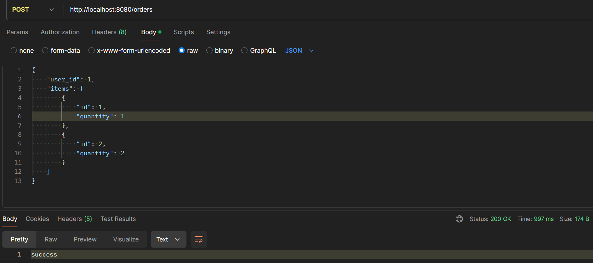

查表得到结果

**性能测试环节**

相比于功能，更关心响应式架构与传统 MVC 架构的性能有什么区别

首先看是否配置 redis 缓存的区别，还是使用 gatling 作为压测工具，参数是 200 用户，时间为 3s

-   未开启 redis，响应还是挺慢的，因为要查两张表

-   开启 redis，并提前通过预热缓存到内存中，优势尽显，**平均响应时长从 8055ms 下降到 338ms**

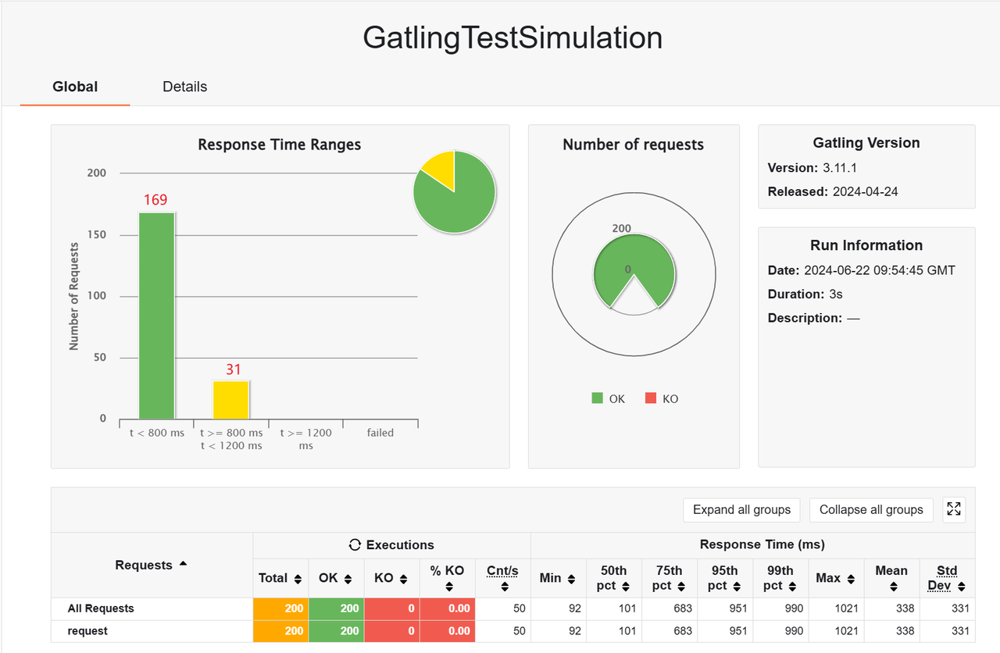

然后来做 aw06 和 aw09 的性能对比，还是 200 用户，时间为 3s

-   aw06
    -   rampUsers，平均响应时长为 2355ms
    -   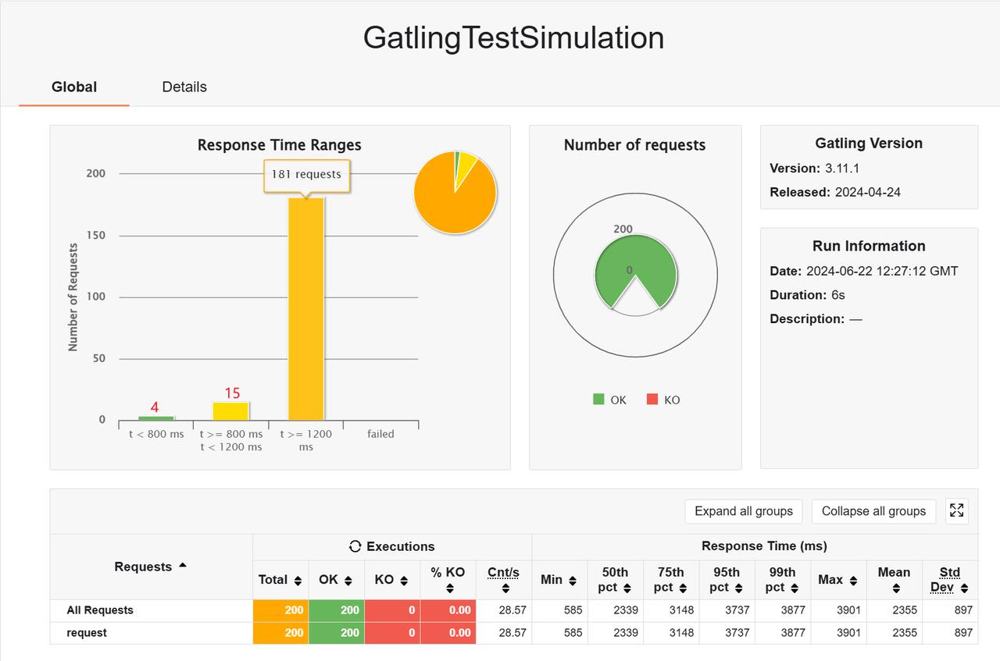
    -   atOnceUsers，平均响应时长为 4128ms，可见瞬时多线程堆积会降低响应的速度
    -   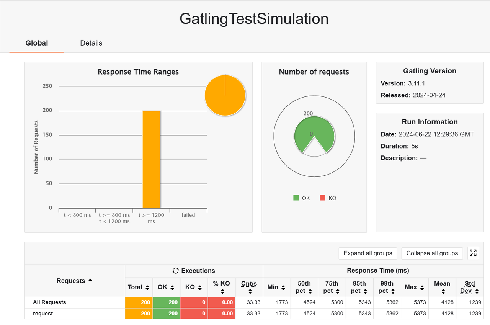

-   aw09
    -   rampUsers，平均响应时长为 3527ms，反而是比 MVC 的慢一些
    -   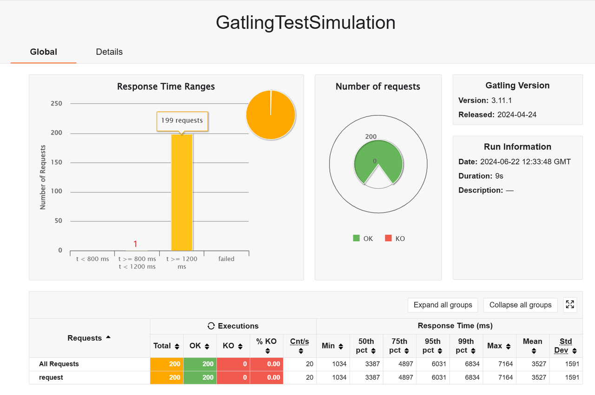
    -   atOnceUsers，平均响应时长为 3414ms，可以体现出异步调用的优势
    -   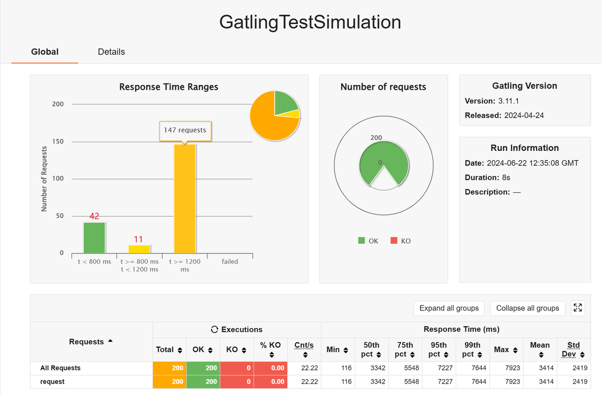

响应式体系的异步框架确实会在瞬时并发量大的情况下有更好的效果，如果是普通的话，和 MVC 架构的差不多，这个结果也是符合预期的

